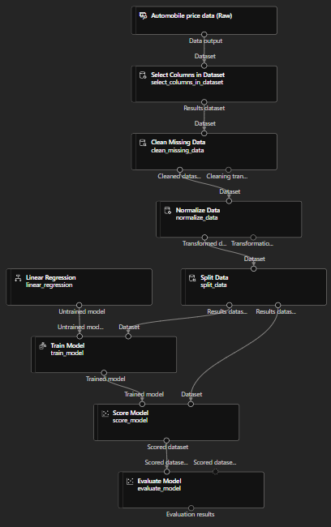
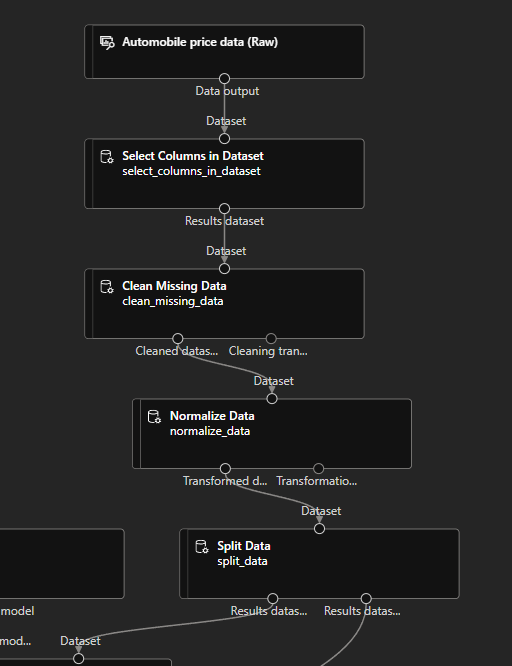
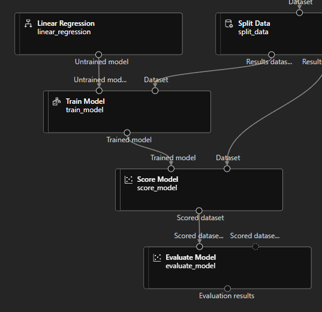

# Linear Regression Model with the Designer
## 1. Create Compute
Setting | Selected
--- | ---
Virtual machine tier | Dedicated
Virtual machine type | CPU
Virtual machine size | DS11_v2
Min. Nodes | 0
Max. Nodes | 2
Idle seconds before scale down | 120

## 2. Design Model
- Designer: Create
  

  

  Components
  

  
    - Sample Data
      - Automobile Price Data (Raw)
    - Data Transformations
      - Select Columns in Dataset
        - by name
        - add all
        -  \- normalized losses
      - Clear missing data
        - Column names: bore,stroke,horsepower
        - Cleaning mode: Remove entire row
      - Normalize Data
        - Transformation method: MinMax
        - Column names: symboling,wheel-base,length,height,width,curb-weight,engine-size,bore,stroke,compression-ratio,horsepower,peak-rpm,city-mpg,highway-mpg
      - Split Data
        - Fraction of rows in the first output dataset: 0.7
        - Random seed: 123
    - Model Training
      - Train Model
        - Column names: price
    - Machine Learning Algorithms
      - Linear Regression
    - Model Scoring & Evaluation
      - Score Model
      - Evaluate Model
      
    

  

  

  Configure & Submit
  

    
    - Create new: car-price-training
    - Select compute type: Compute Cluster
    - Select Azure ML compute cluster: azml-cluster (created)
  

  
- Manage: Compute
  - Check the running cluster

- Jobs 
  - Check the running experiment

## Designed Model

<figure>
  
  <figcaption>Linear Regression Model</figcaption>
</figure>

## 

<figure>
  
  <figcaption>Prepare Data</figcaption>
</figure>

## 

<figure>
  
  <figcaption>Train and Evaluate Model</figcaption>
</figure>

## Deployment

