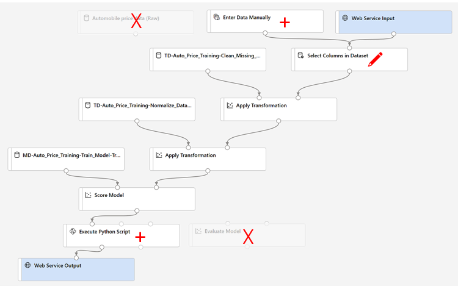

# [Linear Regression Model with the Designer](https://microsoftlearning.github.io/AI-900-AIFundamentals/instructions/02a-create-regression-model.html#create-and-run-an-inference-pipeline)
## 1. Create Compute
Setting | Selected
--- | ---
Virtual machine tier | Dedicated
Virtual machine type | CPU
Virtual machine size | DS11_v2
Min. Nodes | 0
Max. Nodes | 2
Idle seconds before scale down | 120

## 2. Design Model
- **Designer:** Create
  <details>
  <summary>
  Components
  </summary>
  
    - _Sample Data_
      - Automobile Price Data (Raw)
    - _Data Transformations_
      - Select Columns in Dataset
        - by name
        - add all
        -  \- normalized losses
      - Clear missing data
        - Column names: bore,stroke,horsepower
        - Cleaning mode: Remove entire row
      - Normalize Data
        - Transformation method: MinMax
        - Column names: symboling,wheel-base,length,height,width,curb-weight,engine-size,bore,stroke,compression-ratio,horsepower,peak-rpm,city-mpg,highway-mpg
      - Split Data
        - Fraction of rows in the first output dataset: 0.7
        - Random seed: 123
    - _Model Training_
      - Train Model
        - Column names: price
    - _Machine Learning Algorithms_
      - Linear Regression
    - _Model Scoring & Evaluation_
      - Score Model
      - Evaluate Model
      
    </details>

  <details>
  <summary>
  Configure & Submit
  </summary>
    
    - Create new: car-price-training
    - Select compute type: Compute Cluster
    - Select Azure ML compute cluster: azml-cluster (created)
  </details>
  
- **Manage:** Compute
  - Check the running cluster

- **Jobs** 
  - Check the running experiment

## 2.1 Designed Model

<figure>
  
  <figcaption>Linear Regression Model</figcaption>
</figure>

## 

<figure>
  
  <figcaption>Prepare Data</figcaption>
</figure>

## 

<figure>
  
  <figcaption>Train and Evaluate Model</figcaption>
</figure>

## 3. Deployment
- **Jobs**
  - `...` > Create Inference Pipeline > Real-Time Inference Pipeline
- **Designer**
  - Eliminate "Data RAW"
  - Web service input
  - Data Input and Output
    - Enter Data Manually
      <details>
        <summary>Data</summary>
 
        ```
        
         symboling,normalized-losses,make,fuel-type,aspiration,num-of-doors,body-style,drive-wheels,engine-location,wheel-base,length,width,height,curb-weight,engine-type,num-of-cylinders,engine-size,fuel-system,bore,stroke,compression-ratio,horsepower,peak-rpm,city-mpg,highway-mpg
         3,NaN,alfa-romero,gas,std,two,convertible,rwd,front,88.6,168.8,64.1,48.8,2548,dohc,four,130,mpfi,3.47,2.68,9,111,5000,21,27
         3,NaN,alfa-romero,gas,std,two,convertible,rwd,front,88.6,168.8,64.1,48.8,2548,dohc,four,130,mpfi,3.47,2.68,9,111,5000,21,27
         1,NaN,alfa-romero,gas,std,two,hatchback,rwd,front,94.5,171.2,65.5,52.4,2823,ohcv,six,152,mpfi,2.68,3.47,9,154,5000,19,26

        ```
      </details>
      
      > You need two inputs (Web Service Input, Enter Data Manually)
      >
      > Edit "Select Column" 
  - Python Language
    - Execute Python Script
      <details>
        <summary>Example Code</summary>
 
        ```python
        
        import pandas as pd

        def azureml_main(dataframe1 = None, dataframe2 = None):

        scored_results = dataframe1[['Scored Labels']]
        scored_results.rename(columns={'Scored Labels':'predicted price'},
                    inplace=True)    
        return scored_results

        ```
      </details>

- **Jobs** -> Deploy
  - Deploy a new real-time endpoint
    - Name: predict-auto-price
    - Description: Auto price regression
    - Compute type: Azure Container Instance

Test the service
 - **Endpoints**
   - Test tab
     - Delete the current data under Input data to test endpoint
       <details>
        <summary>Data</summary>
 
        ```python
        
         {
          "Inputs": {
            "web_service_input": [
              {
                "symboling": 3,
                "normalized-losses": 1.0,
                "make": "alfa-romero",
                "fuel-type": "gas",
                "aspiration": "std",
                "num-of-doors": "two",
                "body-style": "convertible",
                "drive-wheels": "rwd",
                "engine-location": "front",
                "wheel-base": 88.6,
                "length": 168.8,
                "width": 64.1,
                "height": 48.8,
                "curb-weight": 2548,
                "engine-type": "dohc",
                "num-of-cylinders": "four",
                "engine-size": 130,
                "fuel-system": "mpfi",
                "bore": 3.47,
                "stroke": 2.68,
                "compression-ratio": 9,
                "horsepower": 111,
                "peak-rpm": 5000,
                "city-mpg": 21,
                "highway-mpg": 27
              },
              {
                "symboling": 3,
                "normalized-losses": 1.0,
                "make": "alfa-romero",
                "fuel-type": "gas",
                "aspiration": "std",
                "num-of-doors": "two",
                "body-style": "convertible",
                "drive-wheels": "rwd",
                "engine-location": "front",
                "wheel-base": 88.6,
                "length": 168.8,
                "width": 64.1,
                "height": 48.8,
                "curb-weight": 2548,
                "engine-type": "dohc",
                "num-of-cylinders": "four",
                "engine-size": 130,
                "fuel-system": "mpfi",
                "bore": 3.47,
                "stroke": 2.68,
                "compression-ratio": 9,
                "horsepower": 111,
                "peak-rpm": 5000,
                "city-mpg": 21,
                "highway-mpg": 27
              },
              {
                "symboling": 1,
                "normalized-losses": 1.0,
                "make": "alfa-romero",
                "fuel-type": "gas",
                "aspiration": "std",
                "num-of-doors": "two",
                "body-style": "hatchback",
                "drive-wheels": "rwd",
                "engine-location": "front",
                "wheel-base": 94.5,
                "length": 171.2,
                "width": 65.5,
                "height": 52.4,
                "curb-weight": 2823,
                "engine-type": "ohcv",
                "num-of-cylinders": "six",
                "engine-size": 152,
                "fuel-system": "mpfi",
                "bore": 2.68,
                "stroke": 3.47,
                "compression-ratio": 9,
                "horsepower": 154,
                "peak-rpm": 5000,
                "city-mpg": 19,
                "highway-mpg": 26
              }
            ]
          },
          "GlobalParameters": {}
        }

        ```
      </details>


## 3.1 Model Inference

<figure>
  
  <figcaption>Linear Regression Model Inference</figcaption>
</figure>

