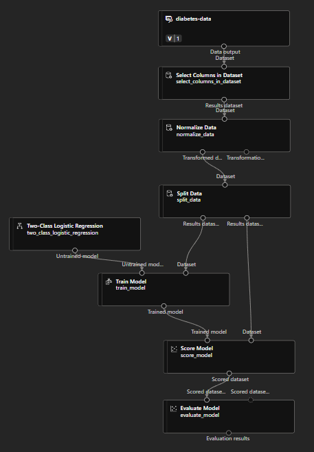

# [Classification Model](https://microsoftlearning.github.io/AI-900-AIFundamentals/instructions/02b-create-classification-model.html#view-the-transformed-data)
## 1. Design model

- **Designer**
  - _Data Transformation_
    - Select Columns in Dataset
      - By name: All - Pacient ID
    - Normalize Data
      - With Rules:
        ```
        Pregnancies, PlasmaGlucose, DiastolicBloodPressure, TricepsThickness, SerumInsulin, BMI, DiabetesPedigree, Age
        ``` 
    - Split Data
      - Splitting mode: Split Row
      - Fraction of rows in the first output dataset: 0.7
      - Randomized split: True
      - Random seed: 123
      - Stratified split: False
  - _Model Training_
    - Train Model
      - Label: Diabetic 
  - _Machine Learning Algorithms_
    - Two-Class Logistic Regression
  - _Model Scoring & Evaluation_
    - Score Model
    - Evaluiate Model
  
- **DATA**
  - Type: Tabular
  - Source: [Web files](https://raw.githubusercontent.com/MicrosoftLearning/AI-900-AIFundamentals.es-ES/main/data/ml/diabetes.csv)
  - Include all columns other than Path
 
<details>
<summary>
Configure & Submit
</summary>

- Create new: car-price-training
- Select compute type: Compute Cluster
- Select Azure ML compute cluster: azml-cluster (created)
</details>

## Designed Model

<figure>
  
  <figcaption>Designed Model</figcaption>
</figure>

## 2. Deployment

- **Jobs**
  - `...` > Create Inference Pipeline > Real-Time Inference Pipeline
- **Designer**
  - Eliminate "Data RAW"
  - Web Service Input
  - Data Input and Output
    - Enter Data Manually
      <details>
        <summary>Data</summary>
 
        ```
        
          PatientID,Pregnancies,PlasmaGlucose,DiastolicBloodPressure,TricepsThickness,SerumInsulin,BMI,DiabetesPedigree,Age
           1882185,9,104,51,7,24,27.36983156,1.350472047,43
           1662484,6,73,61,35,24,18.74367404,1.074147566,75
           1228510,4,115,50,29,243,34.69215364,0.741159926,59

        ```
      </details>
      
      > You need two inputs (Web Service Input, Enter Data Manually)
      >
      > Edit "Select Column" 
  - Python Language
    - Execute Python Script
      <details>
        <summary>Example Code</summary>
 
        ```python
        
         import pandas as pd
    
       def azureml_main(dataframe1 = None, dataframe2 = None):
    
        scored_results = dataframe1[['Scored Labels', 'Scored Probabilities']]
        scored_results.rename(columns={'Scored Labels':'DiabetesPrediction',
                                 'Scored Probabilities':'Probability'},
                         inplace=True)
       return scored_results

        ```
      </details>

- **Jobs** -> Deploy
  - Deploy a new real-time endpoint
    - Name: predict-auto-price
    - Description: Auto price regression
    - Compute type: Azure Container Instance

Test the service
 - **Endpoints**
   - Test tab
     - Delete the current data under Input data to test endpoint
       <details>
        <summary>Data</summary>
 
        ```python
        
          {
           "Inputs": {
             "input1":
               [
                 { "PatientID": 1882185,
                   "Pregnancies": 9,
                   "PlasmaGlucose": 104,
                   "DiastolicBloodPressure": 51,
                   "TricepsThickness": 7,
                   "SerumInsulin": 24,
                   "BMI": 27.36983156,
                   "DiabetesPedigree": 1.3504720469999998,
                   "Age": 43 }
                 ]
               },
           "GlobalParameters":  {}
         }
        ```
      </details>

## Model
<figure>
  
  <figcaption>Inference Classification Model</figcaption>
</figure>


